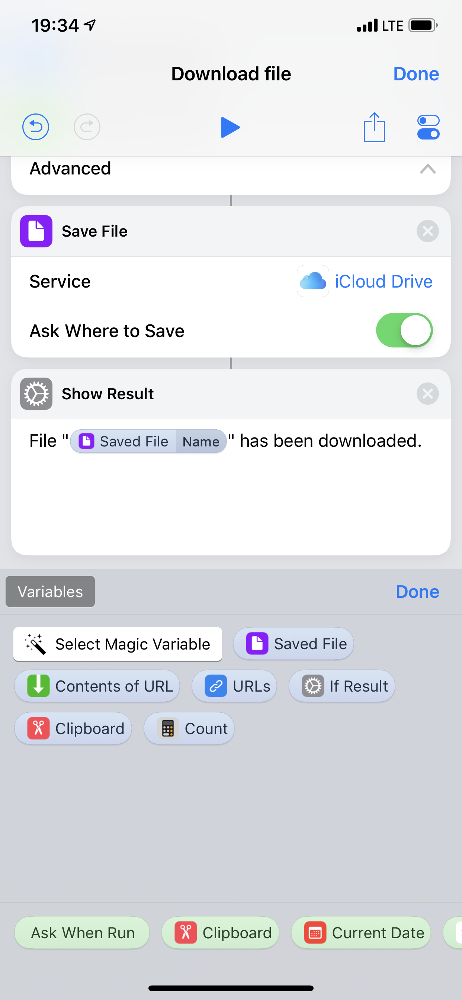
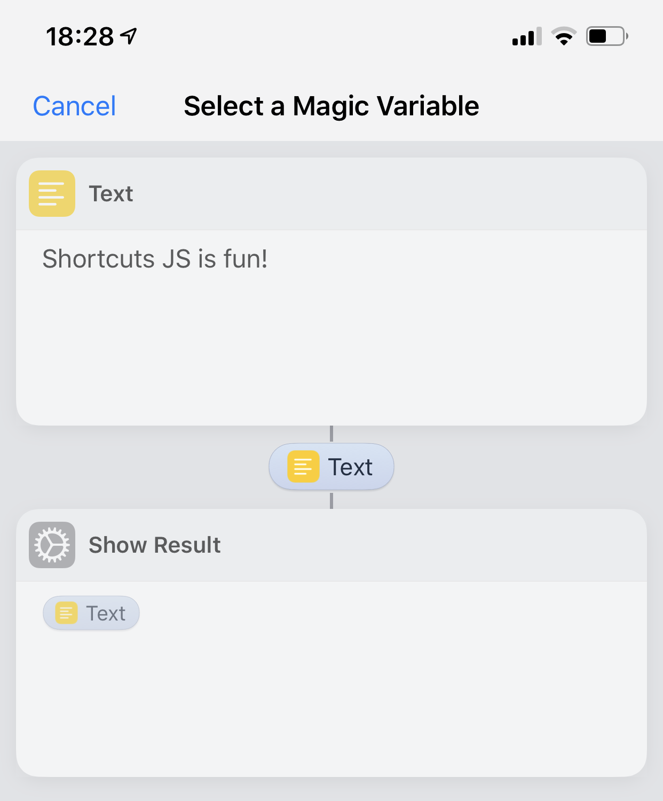
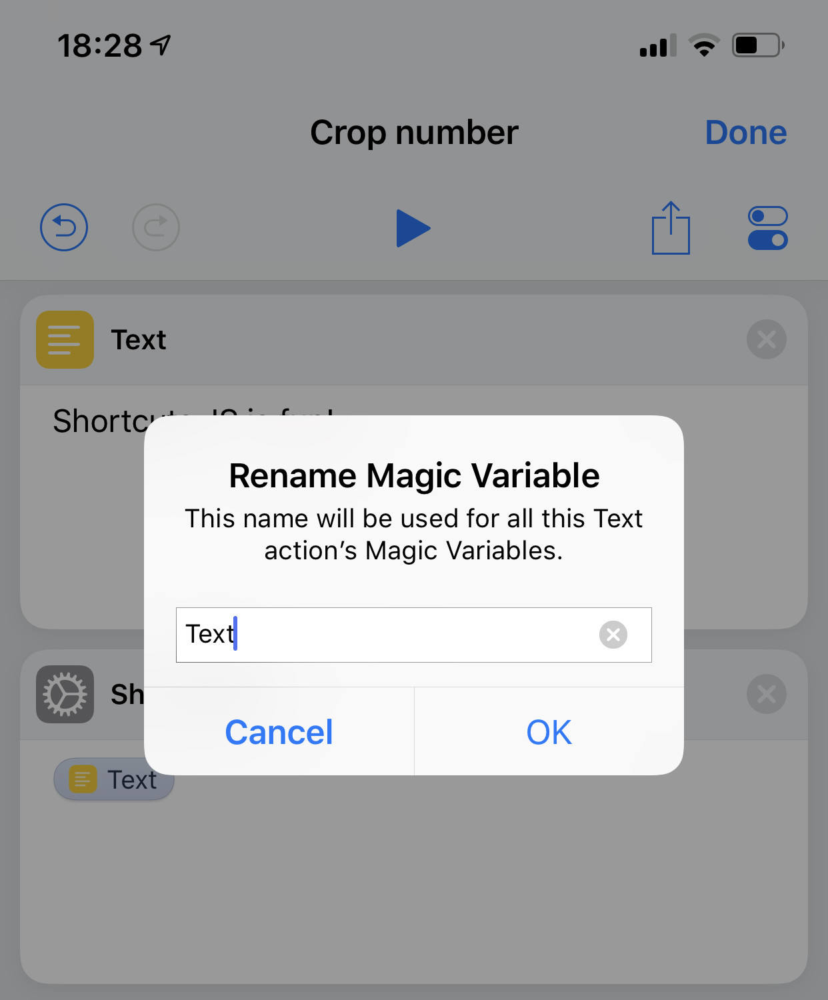

## Variables

As stated in the [Shortcuts official guide](https://support.apple.com/it-it/guide/shortcuts/welcome/ios):

> A variable is a container used to label and store content such as text, images, a web page, or a dictionary of data.
>
> In Shortcuts, variables are represented by small tokens labeled with the name of the variable. You place variables throughout the shortcut to mark where you want to set and retrieve content each time the shortcut is run.



Shortcuts JS let you create and handle all the variable types that the app provides.

#### Magic Variables

In Shortcuts, some actions can have an output. Those outputs can be available as *Magic Variables*. In Shortcuts JS you need to initialize an action output preliminarily. You can do so using the `actionOutput()` function.

 

```js
const { actionOutput } = require('@joshfarrant/shortcuts-js');

const myText = actionOutput();

const actions = [
  text({
    text: 'Shortcuts JS is fun!',
  }, myText), // action output gets stored in myText
  showResult({
    text: withVariables`${myText}`,
  }),
];
```

You can eventually pass a string to `actionOutput()` to assign a custom name to the Magic Variable and it will be reflected in the built Shortcut:

```js
const myText = actionOutput('My Text');
```

#### Named Variables

Named variables are the ones you can create using the *Set Variable* and *Add to Variable* actions. In Shortcuts JS, similarly to Magic Variables, named variables should be initialized preliminarily using the `variable()` function.

```js
const { variable } = require('@joshfarrant/shortcuts-js');

const myVariable = variable('My Variable');

const actions = [
  addToVariable({
    variable: myVariable,
  }),
];
```

#### Global Variables

In each Shortcut, users have access to four different global variables: *Ask When Run*, *Clipboard*, *Shortcut Input* and *Current Date*.

```js
const {
  askWhenRun,
  clipboard,
  shortcutInput,
  currentDate,
} = require('@joshfarrant/shortcuts-js/variables');
```

#### Local Variables

[WIP: `repeatIndex(n)`, `repeatItem(n)`]

### Aggrandizements

[WIP: the `.with()` method]

### Interpolated strings

[WIP: the `withVariables` tag function]
